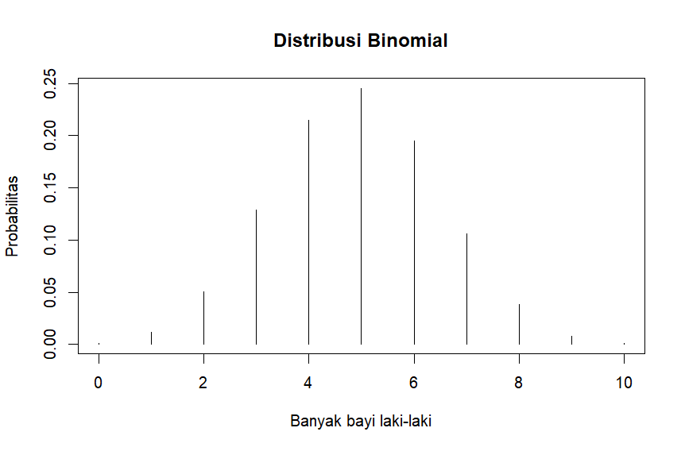
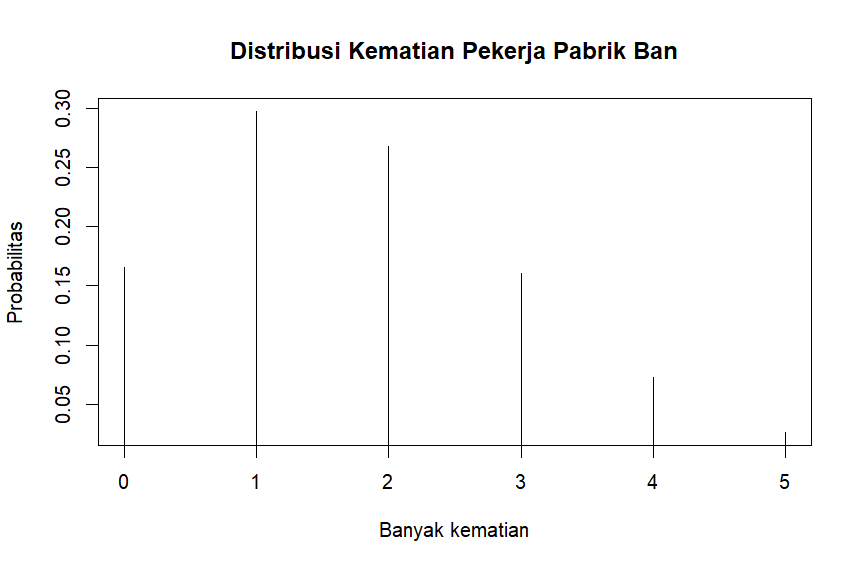

# Prak1_Probstat2023_C_5025211209

### Nama : Nizam Hakim
### NRP  : 5025211209


## No 1

### a.
Karena kemungkinannya hanya 2 kejadian yaitu laki-laki(1) atau perempuan(0) dan ada lebih dari 1 pengulangan maka dapat dinyatakan menggunakan distribusi binomial.

### b.
Untuk peluang pada 1 titik x kita dapat menggunakan fungsi dbinom pada r studio dengan parameter, 
```
dbinom(x, size, prob)
```
- x adalah banyak bayi laki-laki yang peluangnya dicari = 3
- size adalah banyak kelahiran = 10
- prob adalah probabilitas kelahiran bayi laki-laki = 0.488

sehingga:
```
dbinom(3, 10, 0.488)
```

output:
```
0.1286265
```

### c.
Untuk peluang secara kumulatif kita dapat menggunakan fungsi pbinom pada r studio dengan parameter, 
```
pbinom(q, size, prob, lower.tail, log.p).
```
- q adalah batas interval yang peluangnya akan dicari = 2
- size adalah banyak kelahiran = 10
- prob adalah probabilitas kelahiran bayi laki-laki = 0.488
- lower.tail menunjukkan arah interval yang dicari. Jika lower.tail = TRUE maka intervalnya P(X ≤ q) sedangkan jika lower.tail = FALSE maka intervalnya P(X > q). Pada kasus ini kita gunakan lower.tail = TRUE
- log.p bernilai TRUE jika prob dalam bentuk log. Pada kasus ini karena prob tidak dalam bentuk log maka kita gunakan log.p = FALSE


Pada kasus ini karena yang ingin dicari adalah peluang kelahiran bayi laki-laki kurang dari 3 maka nilai-nilai yang mungkin adalah 0, 1, 2 sehingga peluang kumulatif yang dicari adalah kelahiran bayi ≤ 2, maka:

```
c <- pbinom(2, 10, 0.488, lower.tail = TRUE, log.p = FALSE)
c
```

output:
```
0.0636442
```
kita simpan hasilnya dalam variabel c karena akan digunakan pada nomor 1d

### d.
Karena banyak kelahiran maksimal adalah 10 maka peluang kumulatif kelahiran bayi ≤ 10 adalah 1. Peluang kelahiran bayi laki-laki ≥ 3 dapat diartikan sebagai peluang kumulatif kelahiran ≤ 10 dikurangi dengan peluang kumulatif kelahiran 0 sampai 2, maka:
```
1 - c
```

output:
```
0.9363558
```

### e.
Nilai harapan untuk distribusi binomial dapat dicari menggunakan rumus µ = np
- n adalah banyak kelahiran
- p adalah probabilitas kelahiran bayi laki-laki

sehingga:
```
cat('Nilai harapan: ', 10*0.488)
```

output:
```
Nilai harapan:  4.88
```

Simpangan baku adalah akar kuadrat dari varian. Rumus untuk mencari varian adalah n*p*(1 - p).
- n adalah banyak kelahiran
- p adalah probabilitas kelahiran bayi laki-laki
- (1-p) adalah probabilitas kelahiran bayi perempuan

sehingga,
```
variance <- 10*0.488*(1-0.488)
simpanganbaku <- sqrt(variance)
cat('Simpangan baku: ', simpanganbaku)
```

output:
```
Simpangan baku:  1.580683
```

### f.
Kita dapat menggunakan fungsi dbinom dengan parameter dbinom(n, size, prob),
- n adalah sebuah vector berisi 0:10
- size adalah banyak kelahiran = 10
- prob adalah probabilitas kelahiran bayi laki-laki = 0.488

Kemudian menggunakan fungsi plot() kita buat histogramnya dengan parameter,
- x axis = vector 0:10
- y axis = hasil perhitungan probabilitas kelahiran bayi laki-laki 0:10
- type adalah tipe grafik = h (histogram)
- main adalah label histogram = Distribusi Kelahiran Bayi Laki-Laki
- xlab adalah label x axis = Banyak bayi laki-laki
- ylab adalah label y axis = Probabilitas
```
plot(0:10, dbinom(0:10, 10, 0.488), 
     type='h',
     main='Distribusi Kelahiran Bayi Laki-Laki',
     xlab='Banyak bayi laki-laki',
     ylab='Probabilitas'
)
```

output:



## No 2

### a.
Distribusi menggunakan poisson karena diketahui rate of occurence dengan interval waktu tertentu

### b.
Tidak biasa karena peluang jumlah kematian sebanyak 4 relatif rendah. Hal ini dibuktikan dengan hasil perhitungan menggunakan fungsi dpois() pada r studio dengan parameter, 
```
dpois(x, lambda, log = FALSE),
```
- x adalah banyak kematian = 4
- lambda adalah rate of occurence = 1.8
- log bernilai TRUE jika prob dalam bentuk log. Pada kasus ini karena prob tidak dalam bentuk log maka kita gunakan log = FALSE

sehingga,
```
dpois(4, 1.8, log = FALSE)
```

output:
```
0.07230173
```

### c.
Untuk peluang secara kumulatif kita dapat menggunakan fungsi ppois pada r studio dengan parameter, 
```
ppois(q, lambda, lower.tail = TRUE, log.p = FALSE).
```
- q adalah batas interval yang peluangnya akan dicari = 4
- lambda adalah rate of occurence = 1.8
- lower.tail menunjukkan arah interval yang dicari. Jika lower.tail = TRUE maka intervalnya P(X ≤ q) sedangkan jika lower.tail = FALSE maka intervalnya P(X > q). Pada kasus ini kita gunakan lower.tail = TRUE
- log.p bernilai TRUE jika prob dalam bentuk log. Pada kasus ini karena prob tidak dalam bentuk log maka kita gunakan log.p = FALSE

Karena yang ingin dicari adalah P(q ≤ 4) maka,
```
a <- ppois(4, 1.8, lower.tail = TRUE, log = FALSE)
a
```

output:
```
0.9635933
```

kita simpan hasilnya dalam variabel a karena akan digunakan pada nomor 2d

### d.
Banyak kematian > 4 sama halnya dengan peluang kumulatif total yaitu 1 dikurangi dengan peluang kumulatif banyak kematian ≤ 4 sehingga,
```
1 - a
```

output:
```
0.03640666
```

### e.
Pada distribusi poisson nilai Nilai harapan dan Varian adalah sama dengan rate of occurence. Sedangkan standar deviasi adalah akar kuadrat dari varian, sehingga:
```
cat('Nilai harapan: ', 1.8)
cat('Standar Deviasi: ', sqrt(1.8))
```

output:
```
Nilai harapan = 1.8
Standar deviasi = sqrt(1.8)
```

### f.
Kita dapat menggunakan fungsi dpois dengan parameter dpois(n, lambda),
- n adalah sebuah vector berisi 0:5 (pada histogram ini saya hanya mengambil interval 0:5)
- lambda adalah rate of occurence = 1.8

Kemudian menggunakan fungsi plot() kita buat histogramnya dengan parameter,
- x axis = vector 0:5
- y axis = hasil perhitungan probabilitas kematian 0:5
- type adalah tipe grafik = h (histogram)
- main adalah label histogram = Distribusi Kematian Pekerja Pabrik Ban
- xlab adalah label x axis = Banyak kematian
- ylab adalah label y axis = Probabilitas

```
plot(0:5, dpois(0:5, 1.8), 
     type='h',
     main='Distribusi Kematian Pekerja Pabrik Ban',
     xlab='Banyak kematian',
     ylab='Probabilitas'
)
```

output:



### g.
Kita dapat mensimulasikan dengan cara menggenerate random number menggunakan fungsi rpois(n, lambda) dengan parameter,
- n adalah banyak kejadian yang ingin disimulasikan = 100
- lambda adalah rate of occurence = 1.8

Kemudian kita tempatkan hasilnya dalam tabel untuk melihat banyaknya dari tiap-tiap kematian menggunakan fungsi table(), sehingga:
```
table(rpois(100, 1.8)) 
```

output:
```
 0  1  2  3  4  6  8 
23 36 16 16  7  1  1 
```
Baris atas adalah kematian sedangkan baris bawah adalah banyaknya kematian

### h.
Dapat dilihat pada tabel bahwa banyak kematian berpusat pada interval 0:3 sehingga kematian ≥ 4 dapat dianggap tidak wajar, hal ini bersesuaian dengan perhitungan nomor 2d dimana peluang kematian > 4 hanya sebesar 0.03640666


## No 3

### a.
Fungsi probabilitas dari distribusi Chi-Square adalah sebagai berikut:

Sedangkan pada r studio untuk mencari probabilitas pada suatu titik x dapat menggunakan fungsi dchisq(x, df, ncp = 0, log = FALSE)
- x adalah titik yang ingin kita cari probabilitasnya
- df adalah degrees of freedom
- ncp adalah non-centrality parameter 
- log bernilai TRUE jika probability dalam bentuk log dan FALSE jika tidak

### b.
Untuk menggenerate 500 data acak kita dapat menggunakan fungsi rchisq(n, df, ncp = 0) dengan parameter,
- n adalah banyak data acak yang ingin di generate = 500
- df adalah degrees of freedom = 10
- ncp adalah non-centrality parameter, karena tidak diketahui pada soal maka dibiarkan default = 0

Sedangkan untuk membuat histogram kita dapat menggunakan fungsi hist(), sehingga:
```
hist(rchisq(500, 10))
```

### c.
Pada distribusi Chi-Square, nilai Nilai Rataan(mean) = df sedangkan Varian = 2*df, sehingga:
```
Mean = 10
Varian = 2*10
```

## No 4

### a.

### b.
Menggunakan fungsi hist() kita dapat membuat histogram bangkitan data acak vec dengan breaks 50,
```
hist(vec, breaks = 50)
```

### c.
Menggunakan fungsi var() kita dapat menentukan varian bangkitan data acak vec
```
var(vec)
```

## No 5

### a.
Kita dapat menggunakan fungsi dt(x, df, ncp, log = FALSE) pada r studio dengan parameter,
- x adalah peristiwa acak yang dicari = -2.34
- df adalah degrees of freedom = 6
- ncp adalah non-centrality parameter
- log bernilai TRUE jika probability dalam bentuk log dan FALSE jika tidak

sehingga,
```
pt(-2.34, 6)
```

### b.
Untuk probabilitas kumulatif kita dapat menggunakan fungsi pt(q, df, ncp, lower.tail = TRUE, log.p = FALSE) dengan parameter,
- q adalah batas interval yang peluangnya akan dicari = 1.34
- df adalah degrees of freedom = 6
- ncp adalah non-centrality parameter
- lower.tail menunjukkan arah interval yang dicari. Jika lower.tail = TRUE maka intervalnya P(X ≤ q) sedangkan jika lower.tail = FALSE maka intervalnya P(X > q). Pada kasus ini kita gunakan lower.tail = FALSE
- log.p bernilai TRUE jika prob dalam bentuk log. Pada kasus ini karena prob tidak dalam bentuk log maka kita gunakan log.p = FALSE

Karena yang diminta adalah P(q ≥ 1.34) maka,
```
pt(1.34, 6, lower.tail = FALSE)
```

### c.
Karena Distribusi T-Student yang bersifat simetris dan interval yang diminta adalah x < -1.23 atau x > 1.23 maka kita dapat hanya menghitung salah satunya dan mengalikannya dengan 2
```
2 * pt(-1.23, 3)
```

### d.
P(-0.94 ≤ x ≤ 0.94) sama halnya dengan menghitung P(x ≤ 0.94) - P(x ≤ -0.94) sehingga kita dapat mendapatkannya menggunakan fungsi pt() sebagai berikut,
```
pt(0.94, 14) - pt(-0.94, 14)
```

### e. 
Untuk mencari nilai T-score dengan diketahui luasan dibawah kurva kita dapat menggunakan fungsi qt(p, df, ncp, lower.tail = TRUE, log.p = FALSE) dengan parameter,
- p adalah luasannya = 0.0333
- df adalah degrees of freedom = 5
- lower.tail menunjukkan arah interval yang dicari. Jika lower.tail = TRUE maka intervalnya P(X ≤ q) sedangkan jika lower.tail = FALSE maka intervalnya P(X > q). Pada kasus ini kita gunakan lower.tail = TRUE
- log.p bernilai TRUE jika prob dalam bentuk log. Pada kasus ini karena prob tidak dalam bentuk log maka kita gunakan log.p = FALSE

Karena yang diketahui adalah luasan disebelah kiri maka lower.tail = TRUE, sehingga:
```
qt(0.0333, 5, lower.tail = TRUE)
```

### f.
Sama dengan no 5e bedanya adalah karena luasan yang diketahui disebelah kanan maka lower.tail = FALSE
- p adalah luasannya = 0.125
- df adalah degrees of freedom = 25
- lower.tail menunjukkan arah interval yang dicari. Jika lower.tail = TRUE maka intervalnya P(X ≤ q) sedangkan jika lower.tail = FALSE maka intervalnya P(X > q). Pada kasus ini kita gunakan lower.tail = FALSE
- log.p bernilai TRUE jika prob dalam bentuk log. Pada kasus ini karena prob tidak dalam bentuk log maka kita gunakan log.p = FALSE

sehingga,
```
qt(0.125, 25, lower.tail = FALSE)
```

### g.
